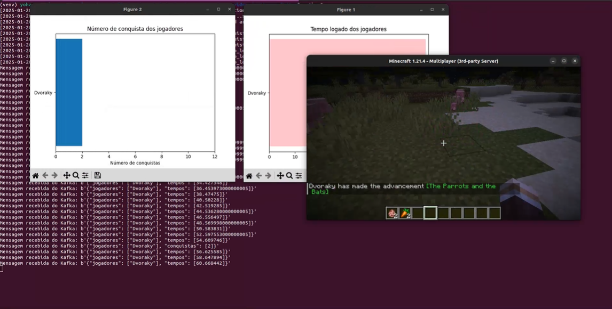

# Monitoramento-de-Servidor-de-Minecraft
Monitoramento de um servidor de Minecraft utilizando do Crafty e Kafka.

## Funcionalidades

- Aplicação Produtora monitora o chat do servidor por palavras na lista de proibidas, expulsando os jogadores que as digitarem.

- Aplicação Consumidora gera dois gráficos em tempo real:
    - Tempo permanecido por jogadores no servidor;
    - Número de conquistas alcançadas.



## Rodando as Aplicações

### Rodando o Servidor Kafka

Use:

```bash
docker compose up
```

### Rodando as Aplicações Python

Crie o ambiente virtual na pasta App:

```bash
python3 -m venv App/venv
```

Ative o ambiente:
- Em Linux:
```bash
source App/vnev/bin/activate
```
- Em Windows:
```bash
cd App/venv/Scripts/
activate
```

Instale as dependências:

```bash
pip install -r <caminhoAtéRequirements.txt>
```

Rodando o consumidor:
```bash
python App/consumer.py
```

Rodando o produtor:
```bash
python App/producer.py
```

Desativando o ambiente virtual:
```bash
deactivate
```